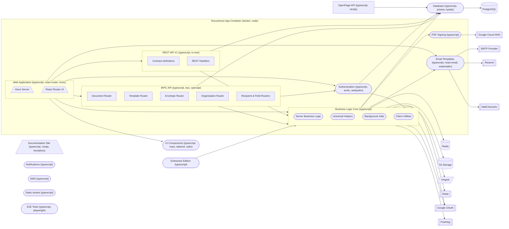
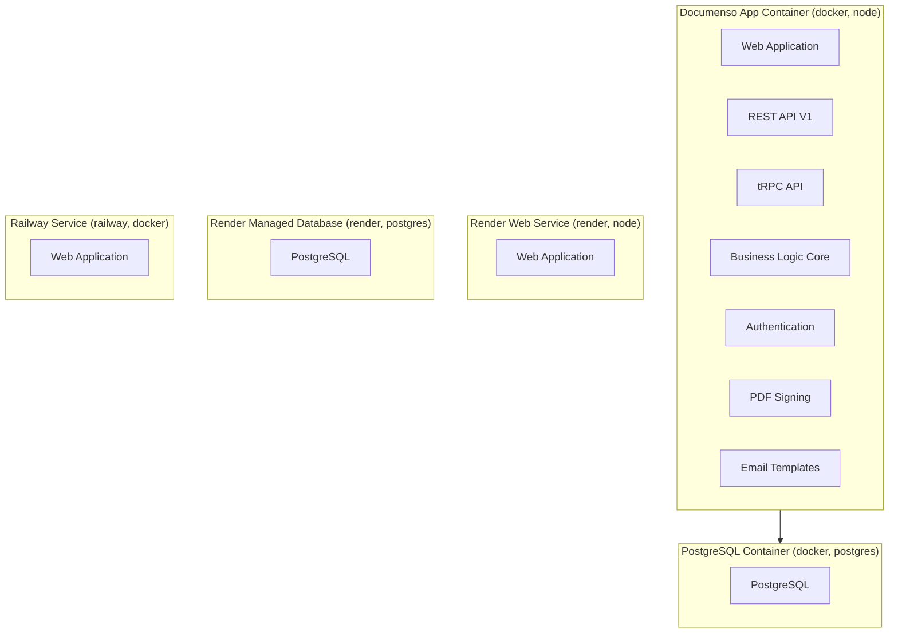

# Architecture

---

### Web Application `typescript, react-router, hono`

Main end-user web app combining the React Router UI and Hono server that mounts all API routes and serves the signing experience.

**Path:** `apps/remix`

**Depends on:** REST API V1, tRPC API, Business Logic Core, Authentication, UI Components, Email Templates, Background Jobs

- **Hono Server** — Node entrypoint that mounts REST v1, tRPC v2, internal tRPC, and jobs handlers under a single HTTP server.
- **React Router UI** — File-based routes split into authenticated, unauthenticated, and recipient signing flows.

### Documentation Site `typescript, nextjs, fumadocs`

Public documentation website for Documenso users and integrators.

**Path:** `apps/docs`

### OpenPage API `typescript, nextjs`

Public analytics API exposing aggregated product metrics.

**Path:** `apps/openpage-api`

**Depends on:** Database

### REST API V1 `typescript, ts-rest`

Deprecated contract-based REST API for documents, templates, recipients, and fields, mounted at /api/v1.

**Path:** `packages/api`

**Depends on:** Business Logic Core, Database

- **Contract Definitions** — ts-rest route contracts describing request and response schemas.
- **REST Handlers** — Request handlers that validate auth tokens and delegate to core business logic.

### tRPC API `typescript, trpc, openapi`

Current tRPC-based API layer powering both the internal UI API and the public V2 OpenAPI surface.

**Path:** `packages/trpc`

**Depends on:** Business Logic Core, Database, Authentication

- **Document Router** — tRPC procedures for document CRUD, sending, and signing lifecycle.
- **Template Router** — tRPC procedures for template management and bulk sending.
- **Envelope Router** — tRPC procedures for multi-document envelope operations.
- **Organisation Router** — tRPC procedures for organisations, teams, members, and billing integration.
- **Recipient & Field Routers** — tRPC procedures for managing signers and their assigned fields on documents.

### Business Logic Core `typescript`

Central library containing server-only business logic, client utilities, universal helpers, and background job definitions.

**Path:** `packages/lib`

**Depends on:** Database, PDF Signing, Email Templates, S3 Storage, Inngest, Redis, Stripe, PostHog, Google OAuth

- **Server Business Logic** — Server-only domain operations for documents, signing, teams, billing, and webhooks.
- **Universal Helpers** — Shared utilities including storage upload abstraction used on both client and server.
- **Background Jobs** — Job provider implementations (Inngest, BullMQ, local) plus job handler definitions.
- **Client Utilities** — Browser-safe helpers consumed by the Remix UI.

### Database `typescript, prisma, kysely`

Prisma schema, migrations, and generated client with a Kysely extension for typed raw queries.

**Path:** `packages/prisma`

**Depends on:** PostgreSQL

### Authentication `typescript, arctic, webauthn`

Authentication module handling OAuth providers, passkey/WebAuthn, sessions, and API token verification.

**Path:** `packages/auth`

**Depends on:** Database, Google OAuth

### PDF Signing `typescript`

Cryptographic PDF signing abstraction supporting local P12 certificates and Google Cloud KMS.

**Path:** `packages/signing`

**Depends on:** Google Cloud KMS

### Email Templates `typescript, react-email, nodemailer`

Transactional email templates and mailer abstraction supporting SMTP, Resend, and MailChannels.

**Path:** `packages/email`

**Depends on:** SMTP Provider, Resend, MailChannels

### Notifications `typescript`

User notification dispatching shared across UI and background jobs.

**Path:** `packages/notifications`

### SMS `typescript`

SMS sending abstraction for signer verification and notifications.

**Path:** `packages/sms`

### UI Components `typescript, react, tailwind, radix`

Shared React component library built on Shadcn, Radix, and Tailwind.

**Path:** `packages/ui`

### Enterprise Edition `typescript`

Enterprise-only features such as advanced auth, audit logs, and compliance extensions.

**Path:** `packages/ee`

**Depends on:** Business Logic Core

### Static Assets `typescript`

Shared static images, icons, and logos used across apps.

**Path:** `packages/assets`

### E2E Tests `typescript, playwright`

Playwright end-to-end tests covering signing, auth, and document flows.

**Path:** `packages/app-tests`

---

## Deployment

**Documenso App Container** `docker, node`
: Single production container image (documenso/documenso) serving the Remix app and all mounted APIs.
  Hosts: Web Application, REST API V1, tRPC API, Business Logic Core, Authentication, PDF Signing, Email Templates
  Depends on: PostgreSQL Container

**PostgreSQL Container** `docker, postgres`
: PostgreSQL 15 container providing the primary application database.
  Hosts: PostgreSQL

**Render Web Service** `render, node`
: Render.com managed web service deployment target defined in render.yaml.
  Hosts: Web Application

**Render Managed Database** `render, postgres`
: Render.com managed PostgreSQL instance (documenso-db) bound to the web service.
  Hosts: PostgreSQL

**Railway Service** `railway, docker`
: Railway deployment target building from docker/Dockerfile.
  Hosts: Web Application
